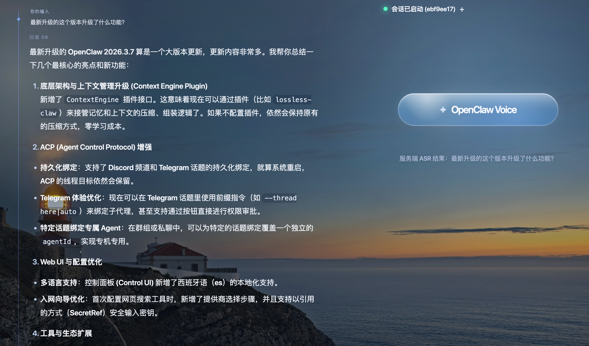
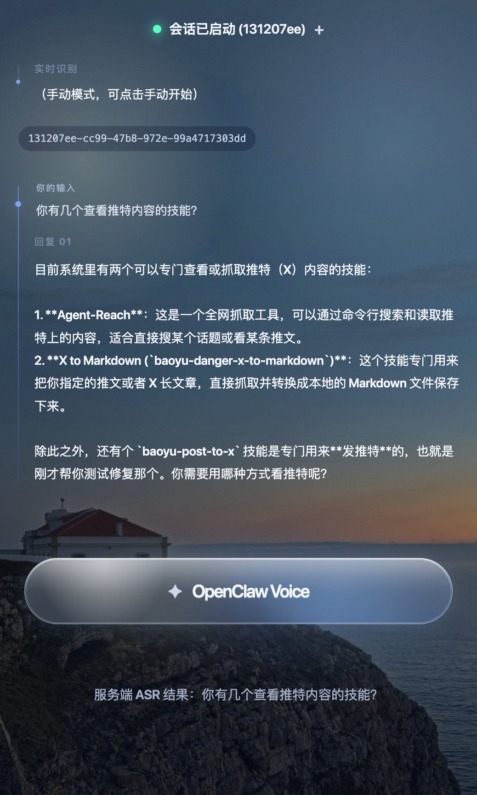

# OpenClaw Realtime Voice

[English README](./README.md)

OpenClaw Realtime Voice 是一套给 OpenClaw 使用的实时语音方案，包含两个必须一起工作的部分：

1. `server/`：音频服务，负责浏览器连接、ASR、TTS、语音会话和调试页面。
2. `openclaw-plugin/`：OpenClaw 频道插件，负责把 OpenClaw 和音频服务接起来。

这个仓库的目标很明确：把 OpenClaw 变成一个可通过浏览器直接进行实时语音交互的助手。

## 这套软件到底是什么

这不是“一个插件文件”，而是一条完整链路：

`浏览器 -> 音频服务 -> ASR -> OpenClaw 插件 -> OpenClaw -> 插件 -> 音频服务 -> TTS -> 浏览器`

所以安装时有一个核心原则：

- 只安装插件，不会说话
- 只启动音频服务，OpenClaw 不会收到消息

你必须同时部署：

- 本仓库里的 **音频服务**
- 本仓库里的 **OpenClaw 插件**

## 界面截图





## 产品范围

当前已经覆盖：

- 浏览器麦克风输入
- VAD 切分
- 实时 ASR（阿里云 / 浏览器转写模式）
- OpenClaw 语音频道接入
- OpenClaw 流式文本回复
- 实时 TTS（阿里云 / 浏览器 TTS 回退）
- 浏览器调试 UI（唤醒词、空格按住说话、开发面板）

当前不做：

- 生产级集群部署
- 原生移动端
- WebRTC 传输
- 完整打磨的 barge-in 中断产品能力

## 仓库结构

```text
openclaw-realtime-voice/
├── server/             # Node.js 音频服务
├── client/             # 浏览器调试 UI（由 server 提供）
├── openclaw-plugin/    # OpenClaw 频道插件
├── contracts/          # 协议与生命周期文档
└── docker-compose.yml  # 可选的容器启动方式
```

## 架构说明

### 组件划分

1. `server/`
   - 暴露 `http://<host>:8080`
   - 暴露 `ws://<host>:8080/channel/voice/ws?token=...`
   - 提供浏览器调试页面
   - 接收浏览器音频或文本
   - 执行 VAD / ASR / TTS
   - 在插件模式或 gateway 模式下转发给 OpenClaw

2. `openclaw-plugin/`
   - 在 OpenClaw 中注册 `voice` channel
   - 主动连接音频服务 websocket
   - 把 OpenClaw 的回复文本再转发回音频服务

3. `client/`
   - 浏览器调试 UI
   - 唤醒词模式
   - 空格按住说话（PTT）
   - 流式音频播放
   - 开发调试面板

### 运行模式

这套仓库支持两种接入模式。

1. `plugin` 模式
   - 默认模式
   - 推荐模式
   - OpenClaw 加载 `openclaw-plugin/`
   - 音频服务等待插件连入
   - 浏览器输入通过插件转成 OpenClaw 频道消息

2. `gateway` 模式
   - 仅用于 standalone 调试
   - 在 `server/.env` 中设置 `OPENCLAW_GATEWAY_BASE_URL` 后启用
   - 音频服务直接调用 OpenClaw HTTP 接口
   - 不依赖 OpenClaw 插件 websocket peer

正常使用建议坚持 `plugin` 模式。

## 数据流

### 正常语音链路

1. 浏览器连接音频服务 websocket。
2. 浏览器发送音频分片。
3. 音频服务执行 VAD 和 ASR。
4. 音频服务把识别出的用户文本转发给 OpenClaw 插件。
5. OpenClaw 流式返回文本。
6. 插件把文本回传给音频服务。
7. 音频服务分句并发送给实时 TTS。
8. 浏览器接收流式音频并播放。

### 调试文本链路

开发面板里的“发送文本”走的是：

`调试文本 -> 音频服务 -> OpenClaw -> TTS -> 浏览器`

这条链路 **不经过 ASR**。

## 先选部署拓扑

这里最容易把人搞糊涂，所以先讲清楚。

### 方案 A：OpenClaw 和音频服务在同一台机器

这是最推荐的本地开发方式。

适合：

- OpenClaw 和本仓库的 `server/` 跑在同一台 Mac / Linux 上
- 你希望配置最简单
- 你先追求链路打通

插件里使用：

- `audioServiceBaseUrl = http://127.0.0.1:8080`
- `audioServiceWsUrl = ws://127.0.0.1:8080/channel/voice/ws`

### 方案 B：OpenClaw 和音频服务在局域网不同机器上

适合：

- OpenClaw 在机器 A
- 本仓库 `server/` 在机器 B
- 浏览器也可能从局域网别的机器访问调试 UI

插件里使用：

- `audioServiceBaseUrl = http://<音频服务局域网IP>:8080`
- `audioServiceWsUrl = ws://<音频服务局域网IP>:8080/channel/voice/ws`

这个方案有三个前提：

- `server/.env` 中 `HOST=0.0.0.0`
- OpenClaw 那台机器能执行 `curl http://<音频服务局域网IP>:8080/`
- 如果 Wi-Fi 重新分配了 IP，必须同步更新 OpenClaw 插件配置

## 快速开始

### 前置要求

- Node.js 20+
- npm 10+
- OpenClaw 已经能正常运行
- 如果使用阿里云 ASR 或 TTS，需要有效的语音 API Key

### 1. 安装音频服务

```bash
cd server
npm install
cp .env.example .env
```

然后编辑 `server/.env`。

最小必填示例：

```env
HOST=0.0.0.0
PORT=8080
VOICE_GATEWAY_TOKEN=dev-token
SPEECH_API_KEY=your-key
ASR_PROVIDER=aliyun
TTS_PROVIDER=aliyun
WAKE_WORDS=你好老六
```

### 2. 启动音频服务

直接用 Node：

```bash
cd server
npm run dev
```

正常启动后应该看到类似日志：

```text
[voice-channel] server started: http://localhost:8080
[voice-channel] lan url: http://<lan-ip>:8080
[voice-channel] websocket: ws://localhost:8080/channel/voice/ws?token=dev-token
```

然后打开：

- `http://localhost:8080`
- 或者日志里打印的局域网地址

### 3. 安装 OpenClaw 插件

把 `openclaw-plugin/` 复制到 OpenClaw 实际使用的插件目录。

常见示例：

```bash
cp -R openclaw-plugin ~/clawd/plugins/voice-channel
cd ~/clawd/plugins/voice-channel
npm install
```

不要跳过插件目录里的 `npm install`。
当前插件有自己的依赖声明。

### 4. 配置 OpenClaw

在 OpenClaw 配置文件中增加或更新插件配置。

同机部署示例：

```json
{
  "plugins": {
    "entries": {
      "voice-channel": {
        "enabled": true,
        "config": {
          "audioServiceBaseUrl": "http://127.0.0.1:8080",
          "audioServiceToken": "dev-token",
          "audioServiceWsUrl": "ws://127.0.0.1:8080/channel/voice/ws"
        }
      }
    }
  }
}
```

局域网异机部署示例：

```json
{
  "plugins": {
    "entries": {
      "voice-channel": {
        "enabled": true,
        "config": {
          "audioServiceBaseUrl": "http://192.168.31.188:8080",
          "audioServiceToken": "dev-token",
          "audioServiceWsUrl": "ws://192.168.31.188:8080/channel/voice/ws"
        }
      }
    }
  }
}
```

插件配置必填项：

- `audioServiceBaseUrl`
- `audioServiceToken`

建议总是显式填写：

- `audioServiceWsUrl`

如果 OpenClaw 和音频服务不在同一台机器上，`audioServiceWsUrl` 必须显式写局域网地址。

### 5. 重启 OpenClaw

插件安装或配置修改后，必须重启 OpenClaw。

然后查看 OpenClaw 日志。

期望看到的握手过程：

```text
[voice-channel][default] CONNECTING ws://...
[voice-channel][default] CONNECTED websocket
[voice-channel][default] STARTED sessionId=...
```

只有出现 `STARTED sessionId=...`，才说明 OpenClaw 语音频道已经真正可用。

## Docker 启动方式

如果你想把音频服务放进容器：

```bash
docker compose up --build
```

对应文件：

- [docker-compose.yml](./docker-compose.yml)
- [server/Dockerfile](./server/Dockerfile)

注意：

- Docker 仍然读取 `server/.env`
- OpenClaw 插件配置里要写的是 **宿主机 IP**，不是容器 IP
- 如果 Docker 拉不到 `node:20-alpine`，先修 Docker Desktop 的网络或代理配置

## 什么时候用 Node，什么时候用 Docker

### 直接用 Node

适合：

- 正在开发
- 需要快速改代码、看日志、重启
- 想减少排障变量

### 用 Docker

适合：

- 想要一套更稳定的本地运行封装
- 想隔离宿主机 Node 环境
- 想让音频服务长时间运行在一台独立机器上

对开发阶段来说，Node 模式通常更简单。

## 关键配置说明

`server/.env` 最重要的是下面这些字段。

### 核心服务配置

- `HOST`：监听地址。局域网部署必须是 `0.0.0.0`
- `PORT`：默认 `8080`
- `VOICE_GATEWAY_TOKEN`：websocket 访问 token，必须与 OpenClaw 插件配置一致
- `VOICE_IDLE_TIMEOUT_MS`：空闲超时，设为 `0` 表示不自动断开
- `WAKE_WORDS`：下发给前端页面的唤醒词列表

### ASR

- `SPEECH_API_KEY`
- `ASR_PROVIDER=browser|aliyun`
- `ASR_URL`
- `ASR_MODEL`
- `ASR_LANGUAGE`
- `ASR_SAMPLE_RATE`

### TTS

- `TTS_PROVIDER=browser|aliyun`
- `TTS_URL`
- `TTS_MODEL`
- `TTS_VOICE`
- `TTS_FORMAT`
- `TTS_SAMPLE_RATE`
- `TTS_MODE=server_commit|commit`

### 可选 Gateway 调试模式

除非你明确要走 HTTP 直连 OpenClaw 调试，否则保持为空：

- `OPENCLAW_GATEWAY_BASE_URL`
- `OPENCLAW_GATEWAY_TOKEN`
- `OPENCLAW_AGENT_ID`
- `OPENCLAW_REQUEST_MODEL`
- `OPENCLAW_CHAT_PATH`
- `OPENCLAW_TIMEOUT_MS`

只要 `OPENCLAW_GATEWAY_BASE_URL` 为空，server 就运行在 `plugin` 模式。

## 浏览器调试页面能做什么

这不是一个纯展示页面，而是联调用的工作台。

支持：

- 唤醒词模式
- 空格按住说话（PTT）
- 流式音频播放
- 手动停止当前 TTS 播报
- 开发模式调试面板
- 左侧对话时间线
- OpenClaw 回复的 Markdown 渲染

当前行为：

- 唤醒词从 `server/.env` 读取
- 很短的 ASR 误触文本（例如 `嗯。`）会在服务端被过滤，不发送给 OpenClaw
- 页面显示文本和 TTS 播报文本分开处理：页面保留格式，TTS 会做清洗后再合成

## 如何验证整套系统已经跑通

### 最小验证清单

1. 启动音频服务。
2. 打开浏览器调试页。
3. 确认页面可以创建 websocket 会话。
4. 确认 OpenClaw 插件日志里出现 `STARTED sessionId=...`。
5. 说一句话或者发送调试文本。
6. 确认能看到：
   - `asr.text`
   - `message.created`
   - `assistant.text.delta`
   - `audio.output.delta`
   - `audio.output.completed`

### 如果只有文本，没有声音

按这个顺序排查：

1. `TTS_PROVIDER` 是否真的是你预期的值
2. 浏览器是否允许播放音频
3. 上一轮是否手动点击过“停止播放”
4. 服务端是否真的收到了 `audio.output.delta`
5. OpenClaw 插件是否真正连接成功，而不是只有浏览器侧会话成功

## 常见问题

### `OpenClaw voice-channel plugin is not connected to audio service`

含义：

- 浏览器已经连上音频服务
- 但 OpenClaw 插件 websocket peer 还没连上

检查：

1. OpenClaw 插件日志
2. 插件配置中的 `audioServiceBaseUrl` 和 `audioServiceWsUrl`
3. `VOICE_GATEWAY_TOKEN` 是否一致
4. 音频服务的局域网 IP 是否已经变化

### `Timed out waiting channel.started (10000ms)`

含义：

- 插件 websocket 已连接
- 但启动握手未完成

请确认使用的是本仓库最新的插件代码。旧版本插件存在启动 ack 竞态问题。

### `connect ECONNREFUSED <ip>:8080`

含义：

- OpenClaw 能到这个 IP
- 但这个 IP:端口上没有服务在接受连接

建议直接检查：

```bash
lsof -iTCP:8080 -sTCP:LISTEN -n -P
curl -v http://127.0.0.1:8080/
curl -v http://<你的局域网IP>:8080/
```

### `connection timeout after 8000ms`

含义：

- 插件尝试连接音频服务
- 但目标 IP 错了，或者路由不通

最常见原因：Wi-Fi 重新给音频服务机器分配了新的局域网 IP。

### OpenClaw 配置校验错误：`must have required property 'audioServiceBaseUrl'`

说明插件配置不完整。
必须补上：

- `audioServiceBaseUrl`
- `audioServiceToken`

### `No WebSocket implementation found`

说明 OpenClaw 运行时 Node 版本太旧。
建议使用 Node 22+ 运行 OpenClaw，或者确保插件目录依赖已经安装完成。

## 给 AI 代理的安装原则

如果你把这个仓库交给 AI 代理安装，它必须按下面的顺序做：

1. 安装 `server/`
2. 配置 `server/.env`
3. 启动音频服务
4. 安装 `openclaw-plugin/` 到 OpenClaw
5. 配置插件地址和 token
6. 重启 OpenClaw
7. 确认插件握手成功
8. 最后再打开浏览器页面测试

这个项目最常见的错误就是只装了一半。
这套软件必须同时部署：音频服务 + OpenClaw 插件。

## 额外文档

- [English README](./README.md)
- [插件说明](./openclaw-plugin/README.md)
- [协议文档](./contracts/voice-channel-service-protocol.md)
